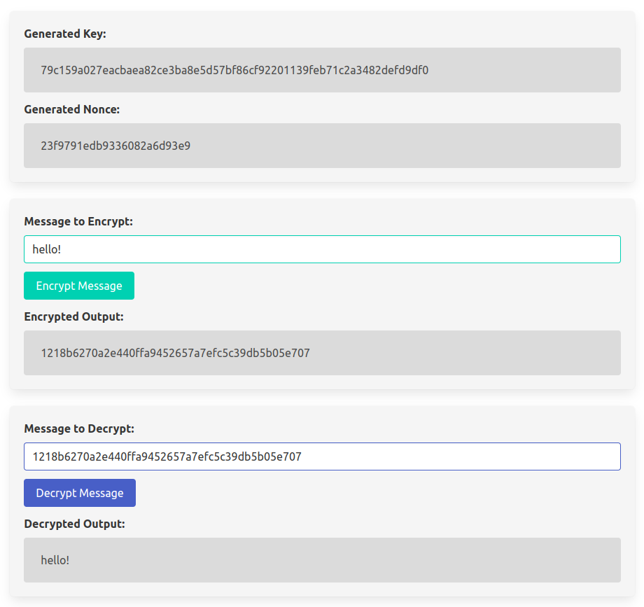

# Karkata

A demonstration of using a Rust crate in Typescript/Javascript/Browser by compiling to WASM.

Uses
- wasm-pack
- RustCrypto AES-GCM

Extra Credit
- Demo app.html showing encryption -> decryption using compiled ES module

Requires
- rust toolchain >= 1.7.0
- wasm-pack
- npm

Build Steps
- `cd aes-gcm && wasm-pack build --target web`
- `npx -p typescript tsc --module esnext --target esnext --outDir . *.ts`

Run
- Using e.g. Deno's file_server (install with `deno install -f --allow-net --allow-read https://deno.land/std/http/file_server.ts`)
  - `file_server .`
  - open output url
